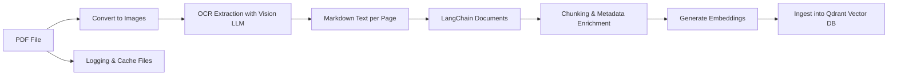

A **robust PDF ingestion pipeline** that converts **any PDF** (scanned or digital) into **vector embeddings** in **Qdrant**.

It handles:

* PDF loading & conversion to images
* OCR extraction using a **Vision LLM** (GPT-4.1-mini)
* Markdown conversion of text, tables, equations
* Chunking & metadata enrichment
* Vector database ingestion with logging & caching

---

## 🛠️ Main Function

`load_chunk_ingest_pdf(pdf_path, subject, semester, unit, version, vision_model, client, collection_name, embedding_model_name, embedding_size)`

**Inputs:**

| Parameter                     | Description                                                   |
| ----------------------------- | ------------------------------------------------------------- |
| `pdf_path`                    | Path to the PDF file                                          |
| `subject`, `semester`, `unit` | Document metadata                                             |
| `version`                     | Ingestion version (e.g., "v1")                                |
| `vision_model`                | LLM for OCR extraction (e.g., GPT-4.1-mini)                   |
| `client`                      | Qdrant client instance                                        |
| `collection_name`             | Name of Qdrant collection                                     |
| `embedding_model_name`        | Name of openai embedding model (e.g., text-embedding-ada-002) |
| `embedding_size`              | Size of embedding vectors (e.g., 1536)                        |

---

## 🔄 Pipeline Flow



**Steps in brief:**

1. **Load PDF & Convert to Images** – Supports scanned & digital PDFs
2. **OCR Extraction** – Extract text, tables, equations, diagrams via LLM
3. **Chunk & Enrich Metadata** – Page info, chunk ID, document ID, subject, etc.
4. **Vector Embeddings & Qdrant Ingestion** – Upload chunks as vectors
5. **Logging & Cache** – PDF-specific logs, global logs, JSON cache

---

## ⚡ Quick Example

```python
from pdf_ingestion_pipeline import load_chunk_ingest_pdf
from langchain_openai import ChatOpenAI
from qdrant_client import QdrantClient

# Initialize OCR LLM
vision_model = ChatOpenAI(model="gpt-4.1-mini")

# Initialize Qdrant client
client = QdrantClient(url="http://localhost:6333")

# Ingest PDF
load_chunk_ingest_pdf(
    pdf_path="sample.pdf",
    subject="Physics",
    semester="Semester 2",
    unit="Unit 4",
    version="v1",
    vision_model=vision_model,
    client=client,
    collection_name="physics_collection",
    embedding_model_name="text-embedding-ada-002",
    embedding_size=1536
)
```

---
